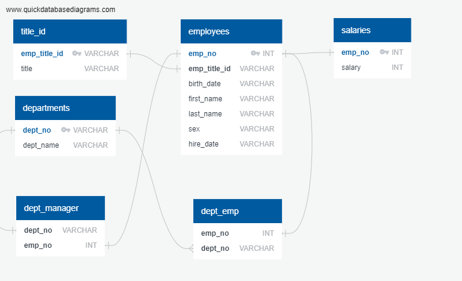

# SQL-Engineering-and-Analysis

Data Engineering and Data Analysis project. Database consists of six CSV files on employees of a corporation from the 1980s and 1990s. The task is to design SQL tables to hold data in the CSVs, import the CSVs into a SQL database, and answer questions about the data. [QuickDBD](http://www.quickdatabasediagrams.com) used to inspect the CSVs and sketch out an ERD of the tables.

## Steps

### Data Modeling

- Inspect the CSVs and sketch out an ERD of the tables.
- Create an image file of the ERD.

### Entity Relationship Diagram (ERD)

### Data Engineering

- Create a table schema for each of the six CSV files.
- Specify data types, primary keys, composite keys, foreign keys, and other constraints.
- Create tables in the correct order to handle foreign keys.
- Import each CSV file into the corresponding SQL table.
- Import the data in the same order that the tables were created and account for the headers when importing to avoid errors.
- Create a .sql file of the table schemata.

### Data Analysis

- List the following details of each employee: employee number, last name, first name, sex, and salary.
- List first name, last name, and hire date for employees hired in 1986.
- List the manager of each department with the following information: department number, department name, the manager's employee number, last name, first name.
- List the department of each employee with the following information: employee number, last name, first name, and department name.
- List first name, last name, and sex for employees whose first name is "Hercules" and last names begin with "B."
- List all employees in the Sales department, including their employee number, last name, first name, and department name.
- List all employees in the Sales and Development departments, including their employee number, last name, first name, and department name.
- In descending order, list the frequency count of employee last names, i.e., how many employees share each last name.
- Create a .sql file of the queries.

## Data Source

- [Mockaroo](https://www.mockaroo.com/)

## Resources

- [QuickDBD]( http://www.quickdatabasediagrams.com).

## Authors

- **David W. Mueller**
  - [LinkedIn Profile](https://www.linkedin.com/in/davidwaltermueller/)
  - davemuelle@gmail.com

## Acknowledgments

- Michigan State University Data Analytics Bootcamp; May 16, 2021.

## References

Mockaroo, LLC. (2021). Realistic Data Generator. <https://www.mockaroo.com/>
